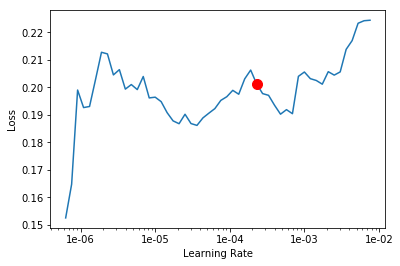

# Introduction

# Detail

## Table of Content
- 需求分析
- 数据来源
- EDA分析
- 数据预处理
- 数据增强
- 建模
	- 模型训练
	- 调参
	- 模型验证
- 错误分析
- 最后结果
- 方案总结

## 需求分析

- 如何解决类别之间距离不等的分类问题
- Train数据和public test数据分布差异很大，over-fitting怎么办？
- 如何选择合适的预处理
- 如何利用好外部数据源提高模型的performance

糖尿病性视网膜病变（DR），也称为糖尿病性眼病，是由于糖尿病导致视网膜受损的医学病症。 它是导致失明的主要原因。 糖尿病视网膜病变影响多达80％的患有糖尿病20年或更长时间的病人。 糖尿病视网膜病变通常没有早期预警信号。视网膜（眼底）摄影with manual interpretation是广泛接受的糖尿病性视网膜病变筛查工具，其性能可超过in-person dilated眼睛检查。

临床医生根据以下等级，以0到4的等级对每个图像中是否存在糖尿病性视网膜病变进行了评分：
- 0-无DR
- 1-轻微
- 2-中度
- 3-严重
- 4-增殖性DR

所以这就是一个分类问题

因为label之间并非等距,我们选择将其作为ordinal classification（OC）任务处理。对于OC任务，普通分类任务常用的交叉熵损失函数并不能很好的反应模型的真实水平，于是我们决定使用**regression**建模。
## 数据来源
南昌一附院 2015年的数据和2019年的数据集
我把他们分成了

- 训练数据 3662
- 测试数 1928

## EDA(Exploratory Data Analysis)
EDA是做这种任务的的必经之路，我们采用的是如下的方法论：

- 思考问题
	- 数据应该怎么清洗和处理才是合理的？
	- 根据数据的类型可以挖掘怎样的特征？
	- 数据中的哪些特征会对标签的预测有帮助？
- 统计分析
	- 数值型
		- 统计量
			- min, max, mean, medium, std 观察Label是否均衡
		- 相关系数
			- 找到高相关的特征以及特征之间的冗余度
		- 工具
			- pandas
	- 文本变量
		- 词频(TF)，TF-IDF，文本长度等
- 可视化
	- 工具
		- matplotlib, seaborn, excel，plotly
具体而言，做了以下几件事：

- 首先看了训练数据的label的分布（具体请看EDA.ipynb）可以看到，不同label之间的数据很不均衡，健康人的比例占到了一半，这也很符合我们对医疗影像数据的预判。
- 看图片的Size，深度学习模型对输入图片的大小敏感，我们发现训练集中图片的短边大小平均值大小约在1527左右，属于高清图片，基本可以随意根据模型输入要求resize。

## 数据预处理

改善模型性能的一种直观方法是简单地改善输入图像的质量：

- **减少照明条件的影响**：拍摄图片的光源强度相差较大，视网膜部位亮暗差别尤为明显，有些图像非常暗并且难以可视化。可以尝试将图像转换为灰度，并且可视化效果更好，采用阈值灰度化处理后的视网膜明暗差别缩小许多
- **区域模糊处理**：视网膜部分在整张图片中占比非常小，经过灰度化处理后的外围斑点与视网膜形状过于接近而难以区分，采用高斯核对外围斑点进行圆形模糊后可有效突出视网膜部分

## 数据增强
- black padding
- flip
- max_zoom

## 建模
由于训练数据较少，我们采用了迁移学习的训练方式。

- 模型选择方面，发现Google的EfficientNet系列模型表现非常优异，不仅准确而且训练非常快速。
- 训练方面，我们先在2015数据上预训练，然后在2019数据上finetune。
- 损失函数方面，选择regession的MSE loss

### 模型训练

- 使用EfficientNet建模训练

[EfficientNet-PyTorch](https://github.com/lukemelas/EfficientNet-PyTorch)

- Stage 1
	- 训练efficientnet-b3, efficientnet-b4, efficientnet-b5，每一个网络都训练5组fold data，产生了15个model
- Stage 2
	- 在stage 1的output上面继续训练 [xgboost](https://github.com/dmlc/xgboost), [svr](https://scikit-learn.org/stable/modules/generated/sklearn.svm.SVR.html)和[catboost](https://github.com/catboost/catboost)三组的LinearRegression模型
- Stage 3
	- 最后做一个combination
### 调参

- 主要是调整learning rate

- 在Fold 1的时候, lr =1e0-6时候最合适

- 在Fold 2的时候, lr =1e0-5时候最合适

- 在Fold 3的时候, lr =1e5-5时候最合适

- 在Fold 4的时候, lr =1e8-6时候最合适

- 在Fold 5的时候, lr =1e-6时候最合适

- 所以综上所述选择一个平均值为1e5-6最合适
- 也包括其他的参数一些调整，

## 模型集成
- Stage1
	- 3个EfficientNet
	
	- 5-Fold  Cross-Validation
		- 分别训练基模型，取出每一个split的test fold上预测logits 输出拼成out-of-fold(OOF), 因为OOF的数据基模型训练时没有见过，这样可以避免标签泄露

# 错误分析
一个优秀的solution少不了细致的错误分析，通用的error analysis流程我总结为：
错误分析->发现改进点/新特征->训练新模型->错误分析（循环下去）
遗憾的是，由于缺乏专业知识，我们很难看出来不同label的眼球的评判标准，这也影响了我们继续深挖特征和预处理。

# 最后的结果

- 最后的submission.csv
- 在test.csv上的93.2 pa的accuracy

# 方案总结
- 更大的input image size配合更简单的图片预处理。直觉上看，分辨率高的图片可能本身就带有能够让DL模型学的更好的图像细节。

- Pseudo Labeling
	- 伪标记是将可靠的预测测试数据添加到训练数据的过程。
	- 5个步骤：
		- 使用训练数据建立模型。
		- 预测未知的测试数据集的标签。
		- 在我们的训练数据中添加可信的预测测试观察结果。
		- 使用组合数据构建新模型。
		- 使用新模型预测测试数据。
	- 为什么Pseudo Labeling有效?

		- 更多的数据可以帮助模型学习。

